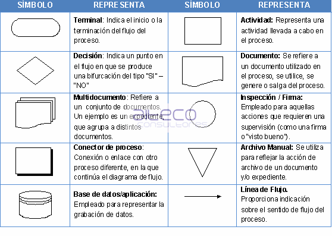
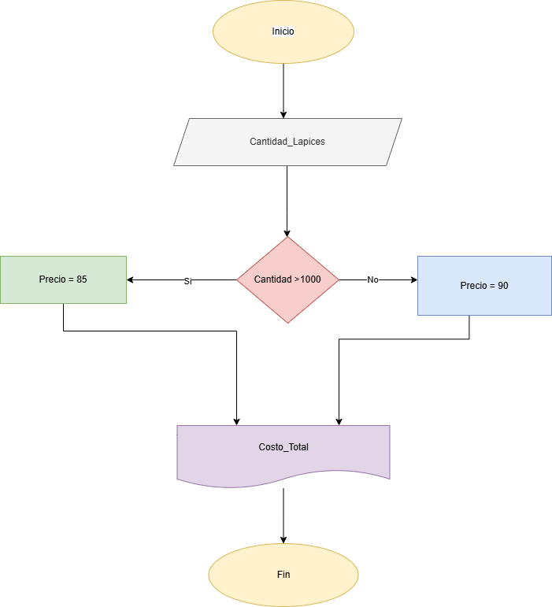
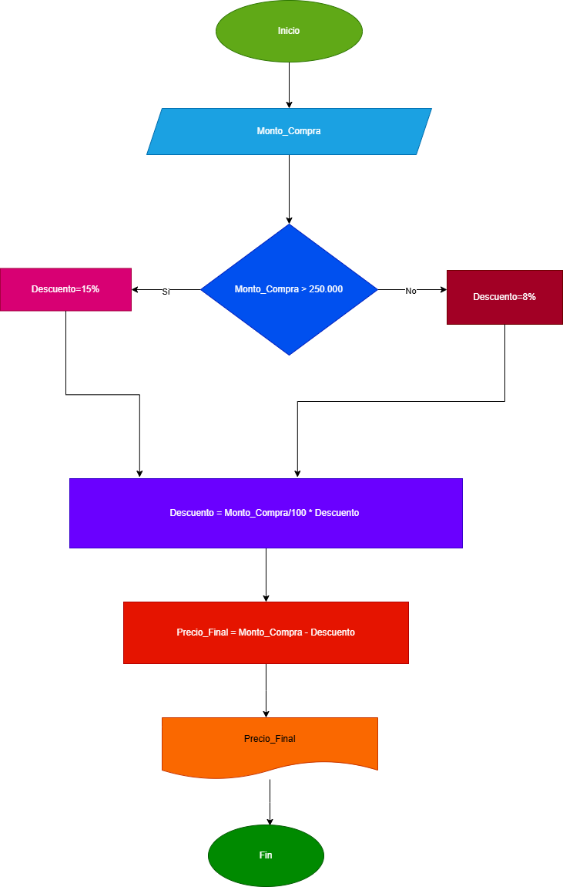
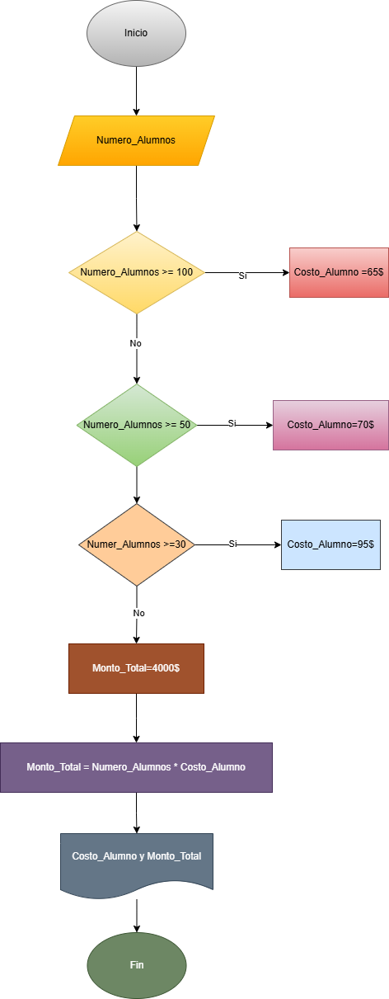
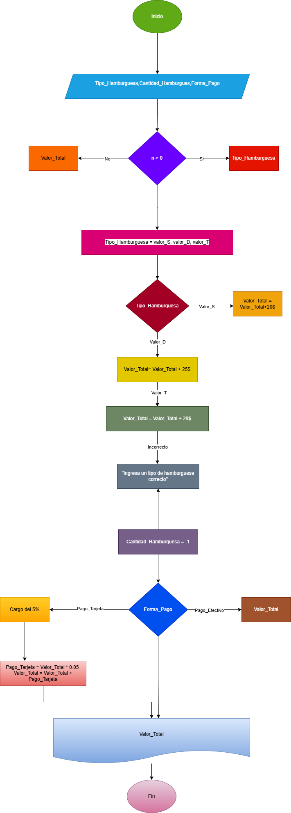

# Algoritmos
##simbolos

# Ejercicio 1.

He investigado los símbolos utilizados para representar operaciones en un diagrama de flujo. Aquí tienes una lista de los símbolos más comunes y sus significados:

### Óvalo: Representa el inicio y el fin del diagrama de flujo.

### Rectángulo: Indica una operación o proceso.

### Rombo Horizontal: Utilizado para decisiones o bifurcaciones en el flujo.

### Paralelogramo: Representa la entrada o salida de datos.

### Flechas: Muestran la dirección del flujo del proceso.

https://edu.gcfglobal.org/es/conceptos-basicos-de-programacion/simbolos-de-un-diagrama-de-flujo/1/?form=MG0AV3

# Ejercicios 2.

### 1. Realice un algoritmo para determinar cuánto se debe pagar por equis cantidad de lápices considerando que si son 1000 o más el costo es de $85 cada uno; de lo contrario, el precio es de $90. Represéntelo con el pseudocódigo y el diagrama de flujo.

## Analisis

### Variables de entrada
Cantidad_Lapices
### Variables de salida
Costo_Total

### Constantes
No Hay

### Otras Variables 
Precio_Unitario

### Ecuaciones
Costo_Total = Cantidad_Lapices * Precio_Unitario

### pseudocodigo
 
 Inicio

    Leer Cantidad_Lapices

Precio_Unitario

    Si Cantidad_Lapices > 1000 
    Entonces Precio_Unitario = 85
     Si no
        precio_Unitario = 90
    Fin si

    Costo_Total = Cantidad_Lapices * Precio_Unitario

    Escribir "El costo total es: $", Costo_Total

FIN

### Diagrama de flujo

### 2. Un almacén de ropa tiene una promoción: por compras superiores a $250 000 se les aplicará un descuento de 15%, de caso contrario, sólo se aplicará un 8% de descuento. Realice un algoritmo para determinar el precio final que debe pagar una persona por comprar en dicho almacén y de cuánto es el descuento que obtendrá. Represéntelo mediante el pseudocódigo y el diagrama de flujo.

## Analisis

### Variables de entrada
Monto_Compra

### Variables de salida
Precio_Final

### Constantes
No hay

### Otras Variables 
Descuento

### Ecuaciones
Descuento = Monto_Compra/100 * Descuento

PrecioFinal = Monto_Compra - Descuento

### pseudocodigo

INICIO

    LEER Monto_Compra

Descuento

    Si Monto_Compra > 250000
     Entonces Descuento = 15%
    Si no
        Descuento = 8%
    Fin Si

    Descuento = Monto_Compra/100 * Descuento

    PrecioFinal = Monto_Compra - Descuento
    Imprimir Precio_Final
    
    Escribir "El descuento es: $" + descuento
    Escribir "El precio final es: $" + precioFinal

FIN

### Diagrama 2

### 3. El director de una escuela está organizando un viaje de estudios, y requiere determinar cuánto debe cobrar a cada alumno y cuánto debe pagar a la compañía de viajes por el servicio. La forma de cobrar es la siguiente: si son 100 alumnos o más, el costo por cada alumno es de $65.00; de 50 a 99 alumnos, el costo es de $70.00, de 30 a 49, de $95.00, y si son menos de 30, el costo de la renta del autobús es de $4000.00, sin importar el número de alumnos.

## Analisis

### Variables de entrada
Numero_Alumno
### Variables de salida
Monto_Total

### Constantes
N

### Otras Variables 
Costo_Total

### Ecuaciones
Monto_Total = 4000
Costo_Alumno = Monto_Total /Numero_AlumnosAlumnos
Monto_Total = Numero_Alumnos * Costo_Alumno

### pseudocodigo

INICIO

    LEER Numero_Alumnos

Costo_Alumno
Monto_Total 

    Si Numero_Alumnos >= 100 
    Entonces Costo_Alumno = 65
    Si no Si Numero_Alumnos >= 50
     Entonces Costo_Alumno = 70
    Si no Si Numero_Alumnos >= 30 
    Entonces Costo_Alumno = 95
    De lo contrario
        Monto_Total = 4000
        Costo_Alumno = Monto_Total / Numero_AlumnosAlumnos
    Fin Si

    Si Numero_Alumnos >= 30
     Entonces Monto_Total = Numero_Alumnos * costo_Alumno
    Fin Si

    Escribir "El costo por alumno es: $" + costoPorAlumno
    SI Numero_Alumnos >= 30 
    Entonces
        Escribir "El monto total a pagar es: $" + montoTotal
    De lo contrario
        Escribir "El monto total a pagar es: $" + montoTotal

FIN

### Diagrama de flujo

#### Ejercicios de clase(No terminado)

1. Inicio

2. leer numero

3. hacer r positivo

4. si no con R negativo

otra vez 

1.Inicio

Hacer SU = 0
Desde C = 1 hasta C = 10
Leer VA
Hacer SU = SU + VA
Fin desde
Escribir SU
Fin

## Enunciado en clase
Inicio

    Leer compra

    Si compra >250000
        descuento = compra * 0,15
    si no
        descuento > compra *0,08
    Fin si
         Total = compra - descuento
        Escribir *total pagar", total
        Escribir"El descuento fue de:"descuento
Fin

suma = 0
for cont in range(1,11,4):
    valor = int(input("ingrese el valor: "))
    suma = suma + valor
    print(f" la suma es: {suma}")

## EJERCICIOS DE CLASE

Un profesor tiene un salario inicial de $1500, y recibe un incremento de 10% anual durante 6 años.¿ Cual es el salario al cabo de 6 años?Realice el algoritmo y represente la solucion mediante el flujo, pseudocodigo y el diagrama N/S, utilizando al ciclo apropiado

#Analisis

- VA:

- No hay 

- SU: 

- Salario final. suma de salario recibidos
    
- salario

- Constantes: 

            inicio
Salario inicial. 1500
incremento=0,1
años: 6
otras variables
desde c = 0 hasta c = 6
    sakario inicial   
     print"el salario del año", c, "es de " salario 

salario_inicial = 1500
incremento = 0.1
años = 6
salario = salario_inicial 
for c in range (0,años,1):
        print(f"El salario el año {c} es de {salario}")
        salario = salario + (salario * incremento)

El salario el año 0 es de 1500
El salario el año 1 es de 1650.0
El salario el año 2 es de 1815.0
El salario el año 3 es de 1996.5
El salario el año 4 es de 2196.15
El salario el año 5 es de 2415.7650000000003

### "El naufrago sastisfecho" ofrece hamburguesas sencillas (S), dobles (D) y triple (T),las cuales tienen un costo de $20, $25 y $28 respectivamnente.La empresa acepta tarjeta de credito con un cargo de 5% sobre la compra. Suponiendo que los clientes adquieren N hambuerguesas las cuales pueden ser de diferente tipo, realice un algoritmo cuanto debe pagar. Representelo el diagrama de flujo, pseudocodigo y diagrama N/S.

### Analisis

#### 1. variable de entrada.

#### Variable de entrada:
Tipo_Hamburguesa,Cantidad_Hamburgues,Forma_Pago

#### 2. variable de salida.
Valor_Total

#### 3.Otras variables
Forma_Pago
Pago_Efectivo
Pago_Tarjeta

#### 4. constantes

1. valor_S = $20

2. valor_D = $25

3. valor_T = $28

INICIO

    Leer Tipo_Hamburguesa,Cantidad_Hamburgues,Forma_Pago

    S = numero de hamburguesas sencillas.

    D = numero de hamburguesa dobles.

    T = numero de hamburguesa triples
    

    Mientras n > 0 Hacer
        
        Escribir "Elige un tipo de hamburguesa: "
        Escribir " valor_S = 20$"
        Escribir " valor_D = 25$"
        Escribir " valor_T = 28$"
        Leer Tipo_Hamburguesa

        Si Tipo_Hamburguesa = valor_S 
        Etonces
            Valor_Total  = Valor_Total + 20
        Si No Tipo_Hamburguesa = valor_D 
        Entonces
               valor_Total = Valor_Total + 25
        Si No Tipo_Hamburguesa = valor_T 
        Entonces
            Valor_Total = Valor_Total + 28
        De lo contrario
            Escribir "Ingresa un tipo de hamburguesa correcto."
        Fin si

        n = n - 1

    Fin mientras
    Escribir "Elige la forma de pago: "
    Escribir "Pago_Efectivo"
    ESCRIBIR "Pago_Tarjeta"
    Leer Forma_Pago

    Si Forma_Pago =  Pago_Tarjeta
    Entonces
        Pago_Tarjeta = Valor_Total * 0.05
        Valor_Total = Valor_Total + Pago_Tarjeta
        ESCRIBIR "Se aplicó un cargo del 5%."
    Fin Si
    Escribir "El total a pagar es: $" + Valor_total

FIN

### Diagrama de flujo

### Diagrma N/S

Inicio

Leer Tipo_Hamburguesa,Cantidad_Hamburgues,Forma_Pago

Ciclo para cada hamburguesa:

Seleccionar Tipo_Hamburguesa.

Calcular Valor_Total según el tipo.

Decrementar número de hamburguesas.

Seleccionar Forma_Pago.

Pago_Tarjeta aplicar cargo por tarjeta.

Mostrar Valor_Total.

Fin

## TAREA DE algoritmo

### Como identificar un algoritmo?

#### Responde si verdad o falso, justifica tu respuesta.

##### 1. Una página web.

- Falso, Una página web no es un algoritmo, pero utiliza algoritmos para hacer tareas como ordenar resultados de búsqueda o mostrar recomendaciones. La página web es el diseño que ves, mientras que el algoritmo es el conjunto de instrucciones que permite que funcione de manera eficiente.

##### 2. Una receta para hacer un pastel, donde se indican ingredientes y pasos a seguir.

- Verdadero, una receta o reseña si se puede ser un algoritmo porque consiste en una serie de pasos secuenciales y bien definidos para lograr un resultado específico que es hacer el pastel. Cada paso tiene instrucciones claras que deben seguirse en un orden determinado, lo que es la característica principal de un algoritmo.

##### 3. "Piensa en un número y multiplícalo por otro".

- Verdadero, sí es un algoritmo porque sigue pasos claros: elegir un número, multiplicarlo por otro y obtener el resultado. Es un proceso secuencial y bien definido. Aunque es una secuencia sencilla, cumple con las características de un algoritmo: tiene una entrada (el número que eligas), un conjunto de pasos (multiplicarlo) y un resultado(que es el producto).

##### 4. Un manual de instrucciones para armar un mueble, con pasos detallados y un orden claro.

- Verdadero, un manual de instrucciones para armar un mueble puede considerarse un algoritmo. Tiene pasos a detalle y una orden espicifica que se debe seguir para lograr el objetivo exitosamente, que es armar el mueble correctamente, si el caso de no decidir seguir los pasos puede que no te quede el mueble correctamente armado.

##### 5.Una lista de compras organizada en orden alfabético.

- Verdadero, una lista de compras organizada alfabéticamente es un algoritmo, porque sigue unos pasos específicos: hacer la lista, ordenarla y luego comprar según ese orden.

### variable o constantes.

#### Indica si las siguientes afirmaciones describen una variable o una constante:

##### 1. El valor de la gravedad en la Tierra, 9.8 m/s².

- Es una constante, Porque la gravedad es algo que nunca cambia, osea en ciertos lugares en la tiweea puede llegar a tener una gravedad algo diferente a esa, pero esa gravedad nunca cambiara. Conocida tambien como constante gravitacional.

##### 2. La edad de una persona calculada en base al año actual y su año de nacimiento.

- Es una variable, A persar de que es algo que pasa cada año en la misma fecha, la fecha es una variable cuantitativa, porque cambia con el tiempo. A medida que la persona envejece va á seguir aumentando la edad, por lo que no es un valor constante. ya que tiene sentido calcular la diferencia entre fechas. Incluso la diferencia entre la fecha de nacimiento y la fecha actual es la edad de la persona.

##### 3. La cantidad de dinero en una cuenta bancaria.

- Una variable, porque La cantidad de dinero en una cuenta bancaria siempre puede llegar a variar. Osea que no puede ser un algoritmo, porque va a ír cambiando con el tiempo dependiendo de los depósitos que pagues, retiros que hagas ó otros movimientos financieros en tu cuenta bancaria. Nunca vas a tener un valor ó una cantidad de dinero constantemente en tu cuenta.

##### 4. La velocidad de la luz en el vacío, 299,792,458 m/s.

- Es una constante, La velocidad de la luz en el vacío, 299,792,458 m/s siempre sera es una constante, porque es un valor fijo y universal que no cambia en condiciones normales, sin importar la situación o el lugar. La velocidad de la luz en el vacío es una constante absoluta en la física. No cambia en ningún contexto o situación

##### 5. El radio de un círculo.

- Es una variable, el radio de un círculo es una variable, porque su valor puede cambiar dependiendo del tamaño del círculo. El radio es la distancia desde el centro del círculo hasta cualquier punto de su borde, y puede variar para diferentes círculos.

###  Características de los Algoritmos.

#### Responde si los siguientes enunciados cumplen con las características de un algoritmo. Justifica la respuesta:

##### 1. Para elegir la ruta más corta entre varias ciudades, el algoritmo examina rutas candidatas, deteniéndose cuando los cambios en la distancia parecen lo suficientemente pequeños.

##### 2. Suma los números ingresados y muestra el resultado.

##### 3. Un conjunto de pasos para calcular el área de un rectángulo dado su base y altura.

##### 4. El algoritmo cuenta el número de votos obtenidos por cada uno de los candidatos de una elección para presidente. Empieza solicitando el nombre del candidato y finaliza cuando se ingresa el valor -1.

### Comprensión de Herramientas.

#### Indica si las siguientes afirmaciones son ciertas o falsas respecto al pseudocódigo y diagramas de flujo:

##### 1. El pseudocódigo utiliza símbolos estándar para representar las operaciones lógicas. 

- La afirmación es verdadera.

- El pseudocódigo utiliza símbolos estándar para representar operaciones lógicas, como AND, OR, NOT, y los valores true (verdadero) y false (falso). Estos símbolos son convencionales y se usan para describir las condiciones lógicas en algoritmos de manera clara y comprensible.

##### 2. Los diagramas de flujo son una representación gráfica de un algoritmo.
- verdadera,Los diagramas de flujo son una representación gráfica de un algoritmo que muestran de manera visual la secuencia de pasos a seguir para resolver un problema o realizar una tarea específica. Utilizan símbolos y flechas para representar acciones y decisiones, lo que facilita la comprensión y comunicación de ideas complejas. Son muy útiles para planificar y organizar proyectos, ya que permiten identificar posibles errores o mejoras en el proceso antes de llevarlo a cabo

##### 3. El pseudocódigo debe estar escrito en un lenguaje de programación específico.
- verdadera, El pseudocódigo no tiene que estar escrito en un lenguaje de programación específico. Es una forma simple y clara de describir algoritmos usando un lenguaje cercano al natural, sin preocuparse por la sintaxis de los lenguajes de programación. Su objetivo es facilitar la comprensión y diseño de algoritmos

##### 4. Un diagrama de flujo siempre debe tener un inicio y un fin claramente definidos.
Los diagramas de flujo siempre deben tener un inicio y un fin claramente definidos. Esto es esencial para asegurar que el proceso o el algoritmo representado sea comprensible y lógico. El "Inicio" marca el punto de entrada al proceso, mientras que el "Fin" indica cuándo el proceso ha concluido. Estos puntos ayudan a organizar los pasos intermedios y a asegurar que el flujo del diagrama sea coherente y fácil de seguir.

#### 5. Estructuras de Control.

- Las estructuras de control son importantes porque nos ayudan a tomar decisiones y realizar acciones basadas en ciertas condiciones. En programación, hay tres tipos principales: secuenciales, condicionales y bucles. Nos permiten dirigir el flujo del programa de manera lógica.

- Ejemplo de la vida diaria: Decidir si llevar un paraguas.

- Secuencial: Levantarse, lavarse los dientes, desayunar.

- Condicional: Si está lloviendo, tomar el paraguas. Si no, salir sin él.

- Bucle: Cepillarse los dientes hasta que estén limpios.

- Ejemplo con cálculos matemáticos: Decidir si comprar un producto según el presupuesto.

- Secuencial: Calcular presupuesto, anotar gastos, determinar presupuesto restante.

- Condicional: Si el precio del producto es menor o igual al presupuesto, comprarlo. Si no, no comprarlo.

- Bucle: Revisar todos los gastos.

- Estas estructuras nos permiten organizar y ejecutar acciones de manera lógica y eficiente.